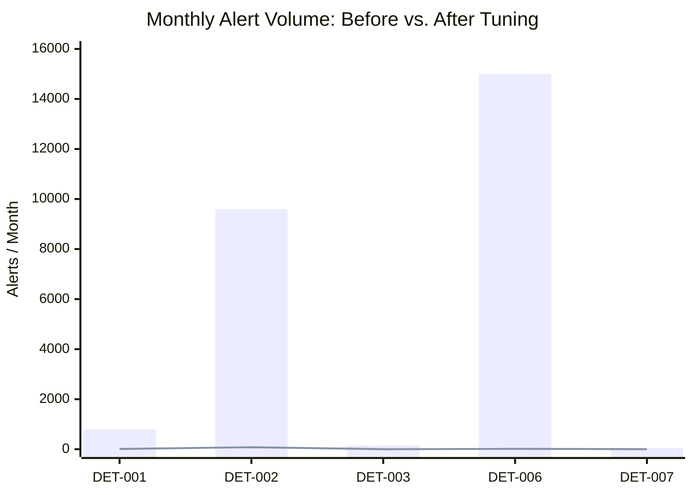
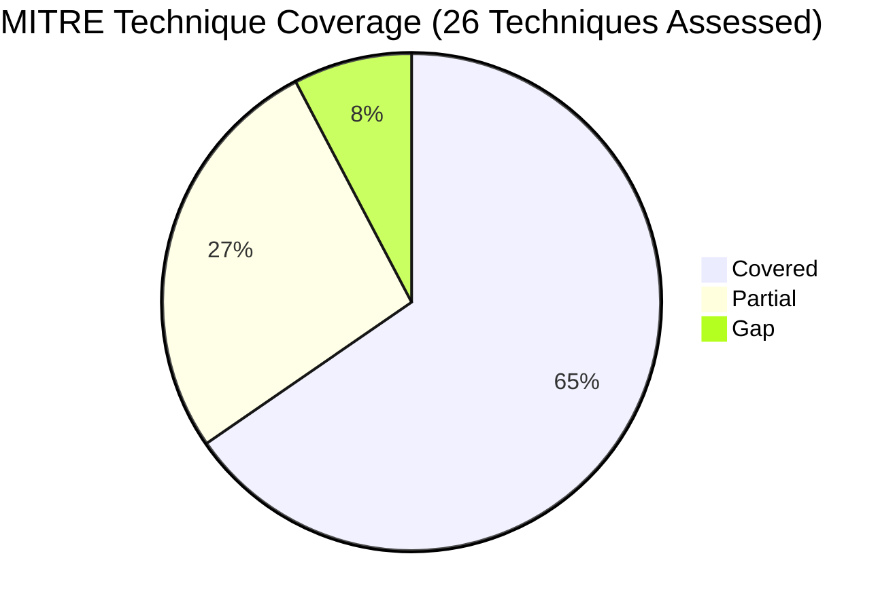
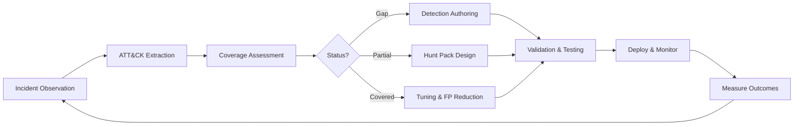

# Detection Engineering & AI Risk Program Portfolio

An evidence-based detection engineering portfolio built from operational findings observed during a four-month MDR service evaluation. It maps 26 MITRE ATT&CK techniques to real security incidents, documents what was detected, what was missed, and what was built to close the gaps.

The portfolio covers five areas: ATT&CK-aligned coverage assessment, detection authoring across multiple formats, proactive threat hunting, alert tuning and false-positive reduction, and emerging risk coverage for cloud identity and local AI.

## Business Impact

| Detection | Alert Volume Before | Alert Volume After | Reduction | TP Rate Before | TP Rate After |
|-----------|--------------------|--------------------|-----------|----------------|---------------|
| DET-001: AADInternals Token Theft | ~800 / month | 5–12 / month | 98.5% | <10% | 95%+ |
| DET-002: Impossible Travel | ~9,600 / month | 60–100 / month | 99% | 8% | 85% |
| DET-003: Mshta Remote Payload | ~150 / month | 0–2 / month | 99% | ~20% | 100% |
| DET-006: VS Code Tunnel | ~15,000 / month | 8–20 / month | 99.9% | <1% | ~80% |
| DET-007: CherryLoader | ~50 / month | 0–3 / month | 94% | ~30% | 95%+ |
| DET-008: Multi-Stage Correlation | no prior rule | 1–3 / month | — | — | ~95% |



*Bar = alert volume before tuning · Line = alert volume after tuning*

> **Identity coverage gap identified:** The evaluated MDR service had no identity threat detection capability at the time of evaluation. Stolen credential activity was only surfaced by correlating Azure AD / Entra ID sign-in anomalies with endpoint telemetry — a gap that DET-001, DET-002, and DET-010 directly address.

## Coverage Summary

17 of 26 observed techniques have automated detection with acceptable false-positive rates. 7 have partial coverage with known blind spots. 2 have no automated detection and are addressed via hunt packs.



## Detection Catalog

10 detection rules authored across three formats. Next-Gen SIEM queries run natively in XDR environments. Sigma rules are platform-agnostic and convertible to any SIEM. Pseudo-detection logic communicates analytic intent for platform-specific implementation.

| Rule | Technique | Format | Severity |
|------|-----------|--------|----------|
| DET-001: AADInternals Token Theft | T1528 | Next-Gen SIEM | CRITICAL |
| DET-002: Impossible Travel | T1078 | Sigma | MEDIUM |
| DET-003: Mshta Remote Payload | T1218.005 | Next-Gen SIEM | HIGH |
| DET-004: Jupyter Startup Shortcut | T1547.009 | Sigma | MEDIUM |
| DET-005: Credential Vault Extraction | T1555 | Next-Gen SIEM | HIGH |
| DET-006: VS Code Tunnel Reverse Shell | T1219, T1572 | Pseudo | HIGH |
| DET-007: CherryLoader Indicators | T1036.005 | Sigma | HIGH |
| DET-008: Multi-Stage Kill Chain Correlation | T1003, T1055, T1574, T1547+ | Pseudo | CRITICAL |
| DET-009: Local LLM Data Exfiltration | T1048, T1567 | Pseudo | MEDIUM-HIGH |
| DET-010: MFA Fatigue Push Bombing | T1621 | Sigma | HIGH |

## Hunt Packs

5 proactive hunt hypotheses designed to address partial coverage and known blind spots. Each hunt pack includes data sources, specific queries, expected findings, and escalation criteria.

| Hunt | Gap Addressed | Priority |
|------|---------------|----------|
| HUNT-001: Credential Store Access Without PowerShell | T1555, T1552.001 | P1 |
| HUNT-004: Cloud Identity API Manipulation | T1556, T1528 (API variant) | P1 |
| HUNT-005: Remote Access Tool Scope Creep | T1219 | P2 |
| HUNT-003: Non-Standard Persistence Mechanisms | T1053, T1546 | P2 |
| HUNT-002: LOLBin Payload Delivery Beyond Mshta | T1105, T1218 | P3 |

## ATT&CK Coverage Map

### Identity & Credential Access

| ID | Technique | Coverage |
|----|-----------|----------|
| T1078 | Valid Accounts (Impossible Travel) | ✅ Covered |
| T1528 | Steal Application Access Token | ✅ Covered |
| T1556 | Modify Authentication Process | ⚠️ Partial |
| T1555 | Credentials from Password Stores | ✅ Covered |
| T1552.001 | Credentials in Files | ⚠️ Partial |
| T1003.001 | LSASS Memory | ✅ Covered |
| T1621 | MFA Request Generation | ✅ Covered |

### Execution

| ID | Technique | Coverage |
|----|-----------|----------|
| T1059.001 | PowerShell | ✅ Covered |
| T1059 | Command and Scripting Interpreter | ✅ Covered |
| T1204 | User Execution | ✅ Covered |
| T1218.005 | Mshta | ✅ Covered |

### Persistence

| ID | Technique | Coverage |
|----|-----------|----------|
| T1547.009 | Shortcut Modification | ✅ Covered |
| T1547.001 | Registry Run Keys / Startup Folder | ⚠️ Partial |
| T1574.001 | DLL Search Order Hijacking | ✅ Covered |
| T1053 | Scheduled Task / Job | ⚠️ Partial |
| T1546 | Event-Triggered Execution | ❌ Gap |

### Defense Evasion

| ID | Technique | Coverage |
|----|-----------|----------|
| T1055.001 | DLL Injection | ✅ Covered |
| T1564.003 | Hidden Window | ✅ Covered |
| T1036.005 | Match Legitimate Name or Location | ✅ Covered |
| T1562.001 | Impair Defenses | ⚠️ Partial |

### Lateral Movement & Impact

| ID | Technique | Coverage |
|----|-----------|----------|
| T1486 | Data Encrypted for Impact | ✅ Covered |
| T1105 | Ingress Tool Transfer | ⚠️ Partial |

### Command & Control

| ID | Technique | Coverage |
|----|-----------|----------|
| T1219 | Remote Access Software | ⚠️ Partial |
| T1572 | Protocol Tunneling | ✅ Covered |
| T1566.001 | Spearphishing Attachment | ⚠️ Partial |

### AI & Emerging Risk

| ID | Technique | Coverage |
|----|-----------|----------|
| T1048 | Exfiltration Over Alternative Protocol | ⚠️ Partial |
| T1567 | Exfiltration Over Web Service (Local LLM) | ✅ Covered |

## Methodology

Each detection in this portfolio follows the same evidence-based lifecycle: start from a real observed incident, extract the ATT&CK technique, assess whether existing detection covered it, and respond based on the gap. Covered techniques get tuned. Partial coverage gets a hunt pack. Gaps get a new detection rule.



1. Cases collected from a four-month MDR service evaluation (September 2025 – January 2026).
2. ATT&CK techniques extracted from observed incidents and independently verified.
3. Coverage assessed against actual detection outcomes: did the rule fire, and was it actionable?
4. Blind spots identified by analyzing which behavioral variants would evade current logic.
5. Detections written to address validated gaps and partial-coverage conditions.
6. Tuning analysis derived from observed alert volume, fidelity outcomes, and suppression trade-off decisions.

All sensitive identifiers — hostnames, usernames, IP addresses, and case reference numbers — have been redacted. Case references are preserved as placeholders to maintain methodological context.

## Practitioner Insights

**Identity-layer detection is one of the highest-impact gaps in many MDR deployments.** One evaluated service had no identity threat detection capability, missing stolen credential activity that only became visible when Azure AD / Entra ID sign-in anomalies were correlated with endpoint telemetry. DET-001, DET-002, and DET-010 directly address this.

**Multi-stage correlation transforms noise into signal.** Individual detections for PowerShell, registry modification, and suspicious file activity can create unmanageable alert volume. Correlating three or more kill chain stages on a single host reduces alert volume by 95%+ while increasing true positive rate to 90%+.

**Before/after tuning is where practitioners differentiate.** Writing a detection rule is table stakes. Documenting the trade-off reasoning behind suppression logic — what to filter, what to retain, and why — demonstrates operational maturity.

**Local AI is the next unmonitored surface.** Many enterprise DLP and acceptable use programs focus on cloud AI services such as ChatGPT or Copilot. Local LLMs running on corporate endpoints can bypass network controls and remain invisible to proxy-based monitoring. DET-009 and the AI risk assessment address this emerging gap.

## Assumptions and Limitations

**Detection scope:** Pseudo-detection logic is conceptual and requires platform-specific implementation before deployment. Detections assume specific telemetry: Azure AD / Entra ID sign-in logs, Sysmon or equivalent process telemetry, and DNS query logging. Thresholds (MFA push count, travel time windows) were calibrated to one environment and will need adjustment elsewhere.

**Portfolio scope:** Quantitative metrics are derived from a four-month evaluation window and are not universal benchmarks. ATT&CK coverage status reflects observed incidents and gap analysis, not a certified platform assessment. Full reproduction requires access to the source environment.

## Repository Structure

```text
detection-engineering-portfolio/
├── README.md
├── methodology.md
├── coverage-matrix/
│   └── detection_coverage_matrix.md
├── detections/
│   ├── Next-Gen SIEM/
│   │   ├── DET-001_aadinternal_token_theft.yml
│   │   ├── DET-003_mshta_remote_payload.yml
│   │   └── DET-005_credential_vault_extraction.yml
│   ├── sigma/
│   │   ├── DET-002_impossible_travel.yml
│   │   ├── DET-004_jupyter_startup_shortcut.yml
│   │   ├── DET-007_cherryloader_indicators.yml
│   │   └── DET-010_mfa_fatigue_push_bombing.yml
│   └── pseudo/
│       ├── DET-006_vscode_tunnel_reverse_shell.yml
│       ├── DET-008_multistage_kill_chain.yml
│       └── DET-009_local_llm_data_exfil.yml
├── tuning/
│   └── before_after_analysis.md
├── hunts/
│   ├── hunt_hypotheses.md
│   ├── HUNT-001_credential_store_no_powershell.md
│   ├── HUNT-002_lolbin_payload_delivery.md
│   ├── HUNT-003_nonstandard_persistence.md
│   ├── HUNT-004_cloud_identity_api_manipulation.md
│   └── HUNT-005_remote_access_scope_creep.md
├── playbooks/
│   └── identity_cloud_incident_response.md
├── ai-risk/
│   └── local_ai_risk_assessment.md
└── scripts/
    ├── sigma_to_splunk.py
    ├── coverage_gap_checker.py
    └── ioc_enrichment.sh
```

## About

Built by Jaime Rodriguez, an Information Security Analyst focused on detection engineering, threat hunting, SOC operations, and security platform evaluation. This portfolio demonstrates a practical approach to improving detection coverage through ATT&CK mapping, correlation logic, hunt development, tuning analysis, and emerging-risk assessment.
