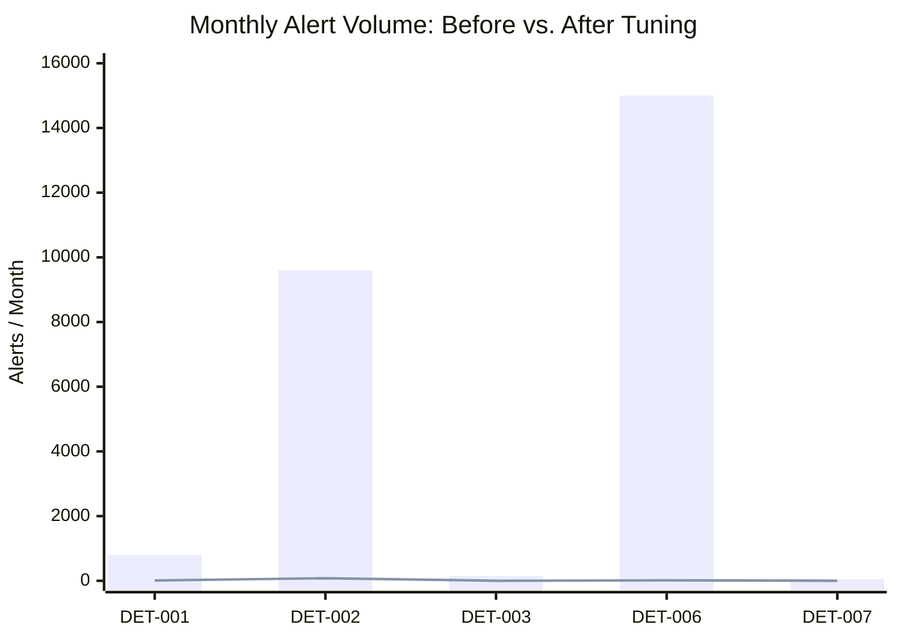
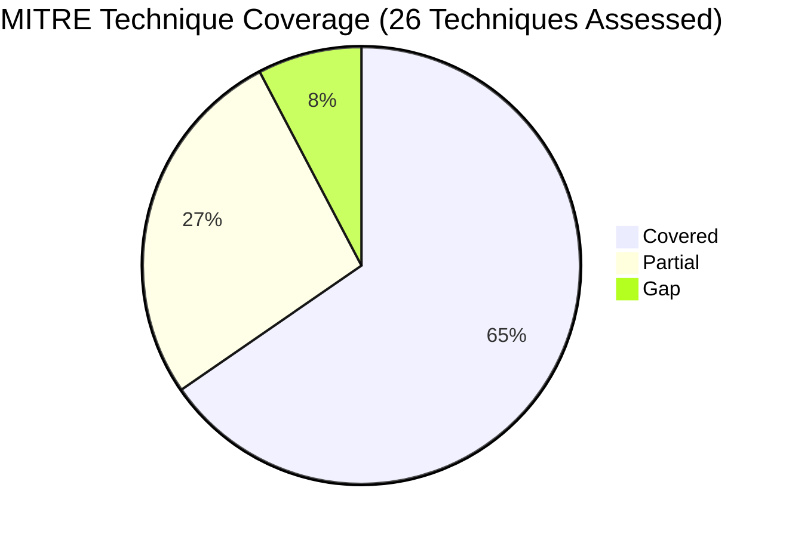
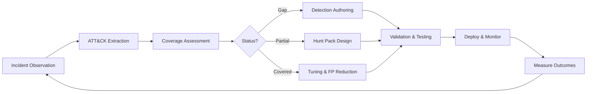

# Detection Engineering & AI Risk Program Portfolio

An evidence-based detection engineering portfolio built from operational findings observed during an MDR service evaluation. It maps 26 MITRE ATT&CK techniques observed across production-relevant security incidents and includes detection rules, hunt packs, an identity incident response playbook, a local AI risk assessment, and supporting automation.

## Outcomes Highlighted in This Portfolio

- 26 ATT&CK techniques assessed across real incident patterns
- 10 detections authored across Next-Gen SIEM, Sigma, and pseudo-detection formats
- 5 hunt packs created to address partial coverage and known gaps
- Multi-stage correlation approaches that reduce alert volume by 95%+ while improving true positive rates
- Coverage extended into cloud identity threats and local AI data exfiltration scenarios

## Business Impact

These numbers come directly from the MDR evaluation and are documented in detail in `tuning/before_after_analysis.md`.

| Detection | Alert Volume Before | Alert Volume After | Reduction | TP Rate Before | TP Rate After |
|-----------|--------------------|--------------------|-----------|----------------|---------------|
| DET-001: AADInternals Token Theft | ~800 / month | 5–12 / month | 98.5% | <10% | 95%+ |
| DET-002: Impossible Travel | ~9,600 / month | 60–100 / month | 99% | 8% | 85% |
| DET-003: Mshta Remote Payload | ~150 / month | 0–2 / month | 99% | ~20% | 100% |
| DET-006: VS Code Tunnel | ~15,000 / month | 8–20 / month | 99.9% | <1% | ~80% |
| DET-007: CherryLoader | ~50 / month | 0–3 / month | 94% | ~30% | 95%+ |
| DET-008: Multi-Stage Correlation | no prior rule | 1–3 / month | — | — | ~95% |



*Bar = alert volume before tuning · Line = alert volume after tuning*

> **Identity coverage gap identified:** The evaluated MDR service had no identity threat detection capability at the time of evaluation. Stolen credential activity was only surfaced by correlating Azure AD / Entra ID sign-in anomalies with endpoint telemetry — a gap that DET-001, DET-002, and DET-010 directly address.

## Start Here

For a quick review of this portfolio, read in this order:

1. `coverage-matrix/detection_coverage_matrix.md` — ATT&CK-mapped coverage assessment
2. `tuning/before_after_analysis.md` — examples of noise reduction without fidelity loss
3. `hunts/hunt_hypotheses.md` — proactive hunt design and prioritization
4. `playbooks/identity_cloud_incident_response.md` — cloud and identity incident response workflow
5. `ai-risk/local_ai_risk_assessment.md` — local AI and shadow AI risk analysis

## Why This Portfolio Matters

This portfolio is designed to demonstrate practical detection engineering capability across five areas:

- ATT&CK-aligned coverage assessment
- Detection authoring across multiple formats
- Threat hunting for known blind spots
- Tuning and false-positive reduction
- Emerging risk coverage for cloud identity and local AI

## Repository Structure

```text
detection-engineering-portfolio/
├── README.md
├── methodology.md                              # Evidence-based detection methodology
├── coverage-matrix/
│   └── detection_coverage_matrix.md           # 26 ATT&CK techniques with coverage status
├── detections/
│   ├── taegis/
│   │   ├── DET-001_aadinternal_token_theft.yml
│   │   ├── DET-003_mshta_remote_payload.yml
│   │   └── DET-005_credential_vault_extraction.yml
│   ├── sigma/
│   │   ├── DET-002_impossible_travel.yml
│   │   ├── DET-004_jupyter_startup_shortcut.yml
│   │   ├── DET-007_cherryloader_indicators.yml
│   │   └── DET-010_mfa_fatigue_push_bombing.yml
│   └── pseudo/
│       ├── DET-006_vscode_tunnel_reverse_shell.yml
│       ├── DET-008_multistage_kill_chain.yml
│       └── DET-009_local_llm_data_exfil.yml
├── tuning/
│   └── before_after_analysis.md               # Noise reduction without fidelity loss
├── hunts/
│   ├── hunt_hypotheses.md                     # Hunt index and prioritization
│   ├── HUNT-001_credential_store_no_powershell.md
│   ├── HUNT-002_lolbin_payload_delivery.md
│   ├── HUNT-003_nonstandard_persistence.md
│   ├── HUNT-004_cloud_identity_api_manipulation.md
│   └── HUNT-005_remote_access_scope_creep.md
├── playbooks/
│   └── identity_cloud_incident_response.md    # Azure AD/Entra ID compromise response
├── ai-risk/
│   └── local_ai_risk_assessment.md            # Local LLM / shadow AI risk program
└── scripts/
    ├── sigma_to_splunk.py                     # Convert Sigma rules to Splunk SPL
    ├── coverage_gap_checker.py                # Map detections to ATT&CK and surface gaps
    └── ioc_enrichment.sh                      # Enrich IPs, hashes, and domains via VirusTotal
```

## Coverage Summary

| Status | Count | Description |
|--------|-------|-------------|
| **Covered** | 17 | Automated detection with acceptable false-positive rate |
| **Partial** | 7 | Detection exists but has known blind spots |
| **Gap** | 2 | No automated detection currently in place; addressed via hunt packs |



## Detection Catalog

| Rule | Technique | Format | Severity |
|------|-----------|--------|----------|
| DET-001: AADInternals Token Theft | T1528 | Next-Gen SIEM | CRITICAL |
| DET-002: Impossible Travel | T1078 | Sigma | MEDIUM |
| DET-003: Mshta Remote Payload | T1218.005 | Next-Gen SIEM | HIGH |
| DET-004: Jupyter Startup Shortcut | T1547.009 | Sigma | MEDIUM |
| DET-005: Credential Vault Extraction | T1555 | Next-Gen SIEM | HIGH |
| DET-006: VS Code Tunnel Reverse Shell | T1219, T1572 | Pseudo | HIGH |
| DET-007: CherryLoader Indicators | T1036.005 | Sigma | HIGH |
| DET-008: Multi-Stage Kill Chain Correlation | T1003, T1055, T1574, T1547+ | Pseudo | CRITICAL |
| DET-009: Local LLM Data Exfiltration | T1048, T1567 | Pseudo | MEDIUM-HIGH |
| DET-010: MFA Fatigue Push Bombing | T1621 | Sigma | HIGH |

## Hunt Packs

| Hunt | Gap Addressed | Priority |
|------|---------------|----------|
| HUNT-001: Credential Store Access Without PowerShell | T1555, T1552.001 | P1 |
| HUNT-004: Cloud Identity API Manipulation | T1556, T1528 (API variant) | P1 |
| HUNT-005: Remote Access Tool Scope Creep | T1219 | P2 |
| HUNT-003: Non-Standard Persistence Mechanisms | T1053, T1546 | P2 |
| HUNT-002: LOLBin Payload Delivery Beyond Mshta | T1105, T1218 | P3 |

## ATT&CK Coverage Map

### Identity & Credential Access

| ID | Technique | Coverage |
|----|-----------|----------|
| T1078 | Valid Accounts (Impossible Travel) | ✅ Covered |
| T1528 | Steal Application Access Token | ✅ Covered |
| T1556 | Modify Authentication Process | ⚠️ Partial |
| T1555 | Credentials from Password Stores | ✅ Covered |
| T1552.001 | Credentials in Files | ⚠️ Partial |
| T1003.001 | LSASS Memory | ✅ Covered |
| T1621 | MFA Request Generation | ✅ Covered |

### Execution

| ID | Technique | Coverage |
|----|-----------|----------|
| T1059.001 | PowerShell | ✅ Covered |
| T1059 | Command and Scripting Interpreter | ✅ Covered |
| T1204 | User Execution | ✅ Covered |
| T1218.005 | Mshta | ✅ Covered |

### Persistence

| ID | Technique | Coverage |
|----|-----------|----------|
| T1547.009 | Shortcut Modification | ✅ Covered |
| T1547.001 | Registry Run Keys / Startup Folder | ⚠️ Partial |
| T1574.001 | DLL Search Order Hijacking | ✅ Covered |
| T1053 | Scheduled Task / Job | ⚠️ Partial |
| T1546 | Event-Triggered Execution | ❌ Gap |

### Defense Evasion

| ID | Technique | Coverage |
|----|-----------|----------|
| T1055.001 | DLL Injection | ✅ Covered |
| T1564.003 | Hidden Window | ✅ Covered |
| T1036.005 | Match Legitimate Name or Location | ✅ Covered |
| T1562.001 | Impair Defenses | ⚠️ Partial |

### Lateral Movement & Impact

| ID | Technique | Coverage |
|----|-----------|----------|
| T1486 | Data Encrypted for Impact | ✅ Covered |
| T1105 | Ingress Tool Transfer | ⚠️ Partial |

### Command & Control

| ID | Technique | Coverage |
|----|-----------|----------|
| T1219 | Remote Access Software | ⚠️ Partial |
| T1572 | Protocol Tunneling | ✅ Covered |
| T1566.001 | Spearphishing Attachment | ⚠️ Partial |

### AI & Emerging Risk

| ID | Technique | Coverage |
|----|-----------|----------|
| T1048 | Exfiltration Over Alternative Protocol | ⚠️ Partial |
| T1567 | Exfiltration Over Web Service (Local LLM) | ✅ Covered |

## Detection Formats

Detections are written in three formats to demonstrate cross-platform capability:

- **Next-Gen SIEM queries** — native platform queries for XDR environments
- **Sigma rules** — portable, platform-agnostic logic convertible to multiple SIEMs and analytics stacks
- **Pseudo-detection logic** — conceptual detections used to communicate analytic intent independent of any single vendor platform

## Practitioner Insights

**Identity-layer detection is one of the highest-impact gaps in many MDR deployments.** One evaluated service had no identity threat detection capability, missing stolen credential activity that only became visible when Azure AD / Entra ID sign-in anomalies were correlated with endpoint telemetry. DET-001, DET-002, and DET-010 directly address this.

**Multi-stage correlation transforms noise into signal.** Individual detections for PowerShell, registry modification, and suspicious file activity can create unmanageable alert volume. Correlating three or more kill chain stages on a single host can reduce alert volume by 95%+ while increasing true positive rate to 90%+.

**Before/after tuning is where practitioners differentiate.** Writing a detection rule is table stakes. Documenting the trade-off reasoning behind suppression logic — what to filter, what to retain, and why — demonstrates operational maturity.

**Local AI is the next unmonitored surface.** Many enterprise DLP and acceptable use programs focus on cloud AI services such as ChatGPT or Copilot. Local LLMs running on corporate endpoints can bypass network controls and remain invisible to proxy-based monitoring. DET-009 and the AI risk assessment are included to address this emerging gap.

## Methodology

This portfolio uses evidence-based detection engineering rather than theoretical coverage mapping:



1. Cases were collected from a four-month MDR service evaluation spanning September 2025 through January 2026.
2. ATT&CK techniques were extracted from observed incidents and independently verified.
3. Coverage was assessed against actual detection outcomes: Did the rule fire, and was it actionable?
4. Blind spots were identified by analyzing which behavioral variants would evade current logic.
5. Detections were written to address validated gaps and partial-coverage conditions.
6. Tuning analysis was derived from observed alert volume, fidelity outcomes, and suppression trade-off decisions.

See `methodology.md` for full methodology documentation.

All sensitive identifiers, including hostnames, usernames, and IP addresses, have been redacted for portfolio use. Case reference numbers are included as redacted placeholders to preserve methodological context while protecting operational details.

## Assumptions and Limitations

### Detection Scope

- Pseudo-detection logic is conceptual and requires platform-specific implementation before deployment; it is not executable as-is.
- Detections assume specific telemetry availability: Azure AD / Entra ID sign-in logs, Sysmon or equivalent process telemetry, and DNS query logging. Environments without these sources will see reduced coverage.
- Detection thresholds (e.g., MFA push count, travel distance and time windows) were calibrated to one environment and will require adjustment in other deployments.
- Some behavioral patterns referenced reflect incident variants observed in a staffing-industry context; applicability varies by industry vertical and endpoint configuration.

### Portfolio Scope

- All sensitive identifiers — hostnames, usernames, IP addresses, and case reference numbers — have been redacted for portfolio use. Full reproduction is not possible without access to the source environment.
- Quantitative metrics (alert reduction percentages, true positive rates) are derived from a four-month MDR evaluation window and should not be extrapolated as universal benchmarks.
- ATT&CK coverage status reflects observed incidents and gap analysis outcomes, not a certified or audited platform capability assessment.
- Validation was performed against evaluation-environment telemetry. Production environments with different logging configurations, data retention policies, or asset inventories may produce different fidelity outcomes.

## About

Built by Jaime Rodriguez, an Information Security Analyst focused on detection engineering, threat hunting, SOC operations, and security platform evaluation. This portfolio demonstrates a practical approach to improving detection coverage through ATT&CK mapping, correlation logic, hunt development, tuning analysis, and emerging-risk assessment.
